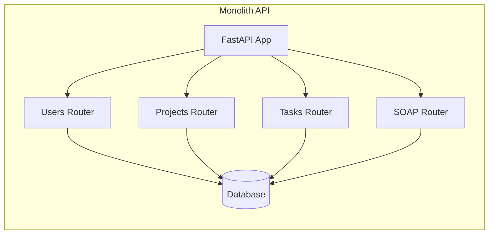

# Mini Gestor de Proyectos — TFU5 UT3 (monolito +SOAP)
Anteriormente: TFU (FastAPI + Docker + ACID + UT4 Architectural Patterns)

Conversión de arquitectura de **microservicios** a **monolito**. Una sola API (FastAPI) desplegada con **Docker Compose**, utilizando **PostgreSQL** y transacciones **ACID**.


## Stack
- Python 3.11 + FastAPI + Uvicorn
- SQLAlchemy 2.x + psycopg2-binary
- PostgreSQL 16 (Docker) / SQLite (local)
- Spyne (SOAP)
- Docker Compose

## Levantar

### Local (sin Docker)
```bash
cd monolith
pip3 install -r requirements.txt
python3 -m uvicorn app.main:app --reload --port 8000
```

### Levantar con Docker
```bash
docker compose up --build
```


### Servicio disponible

- API: http://localhost:8000/docs
- Health: http://localhost:8000/health
- SOAP: http://localhost:8000/soap


## Demostración rápida (curl)

### REST (JSON)
```bash
# Crear usuario
curl -s -X POST http://localhost:8000/users/ -H "Content-Type: application/json" -d '{"name":"Manuela","email":"manu@example.com"}'

# Crear proyecto
curl -s -X POST http://localhost:8000/projects/ -H "Content-Type: application/json" -d '{"name":"TFU","owner_user_id":1}'

# Crear tarea (transacción ACID: task + activity)
curl -s -X POST http://localhost:8000/tasks/ -H "Content-Type: application/json" -d '{"title":"Preparar entrega","project_id":1,"assignee_user_id":1}'

# Ver actividades
curl http://localhost:8000/tasks/1/activities
```

### SOAP (XML)

```bash
curl -X POST http://localhost:8000/soap -H "Content-Type: text/xml" -d '<?xml version="1.0"?>
<soap:Envelope xmlns:soap="http://schemas.xmlsoap.org/soap/envelope/" xmlns:tns="http://monolith.projectmanager.soap">
  <soap:Body><tns:ListAllUsers/></soap:Body>
</soap:Envelope>'
```


## Componentes e interfaces (resumen)

- **Users**: CRUD de usuarios
- **Projects**: CRUD de proyectos
- **Tasks**: CRUD de tareas con `task_activities`. El endpoint de creación crea **dos filas** en una **misma transacción** (ACID).
- **SOAP**: Operaciones via XML (ListAllUsers, CreateUser, GetUserById, etc.)

Todo en una sola base de datos, sin schemas separados.

## UML (Mermaid)


## ¿Por qué monolito?
- **Sin latencia de red**: Todo en memoria, sin HTTP entre servicios
- **ACID simple**: Una transacción SQL estándar
- **Menos complejidad**: 2 contenedores vs 7+
- **Menor overhead**: Sin serialización JSON entre servicios

## ¿Por qué ACID y no BASE?
- ACID por claridad y simplicidad en un TP con una sola base lógica: transacciones atómicas al crear entidades relacionadas dentro de un mismo servicio (ej. `task` + `task_activity`).
- Si usáramos BASE, priorizaríamos disponibilidad y tolerancia a particiones, aceptando consistencia eventual (por ejemplo, colas/Event Sourcing). Implicaría complejidad adicional (reintentos, idempotencia, reconciliación).

## Contenedores vs. VMs
- **Contenedores**: levantan rápido, reproducibles, footprint bajo, fáciles de escalar horizontalmente.
- **VMs**: mayor aislamiento de SO, pero más pesadas y lentas de provisionar para esta demo.

## Estructura
```
monolito/
  app/
    main.py
    database.py
    models.py
    schemas.py
    routers/
      users.py
      projects.py
      tasks.py
      soap_service.py
  Dockerfile
  requirements.txt
docker-compose.yml
validation-scripts/
```

---

## Testing y Validación

### Scripts de Validación

```bash
cd validation-scripts
chmod +x *.sh

# correr todas las pruebas 
./run_all_tests.sh

./test_rest.sh          # prueba para REST/JSON
./test_soap.sh          # prueba SOAP/XML
./test_performance.sh   # probamos Latencia
```

## Atributo de Calidad: Latencia

El monolito mejora la latencia eliminando:
- Llamadas HTTP entre servicios (~1-10ms cada una)
- Serialización/deserialización JSON
- Coordinación de transacciones distribuidas
- Overhead de múltiples contenedores

## Otras mejoras


- Consistencia: 
    - Transacciones ACID nativas (sin sagas ni compensaciones)
    - Sin problemas de consistencia eventual
    - Una sola fuente de verdad

- Menor uso de recursos:
    - Menos memoria (1 proceso vs 4+)
    - Menos CPU (sin overhead de red)
    - Menos almacenamiento (sin Redis, RabbitMQ)

- Facilidad para testear:
    - Tests de integración más simples
    - No necesitamos mockear servicios externos
    - El setup es mas rápido

- Menor costo operacional:
    - Menos contenedores que monitorear
    - Logs centralizados en un solo lugar
    - Menos puntos de falla

> **Scripting de demostración:** ver comandos curl arriba y scripts en `validation-scripts/`
> 

